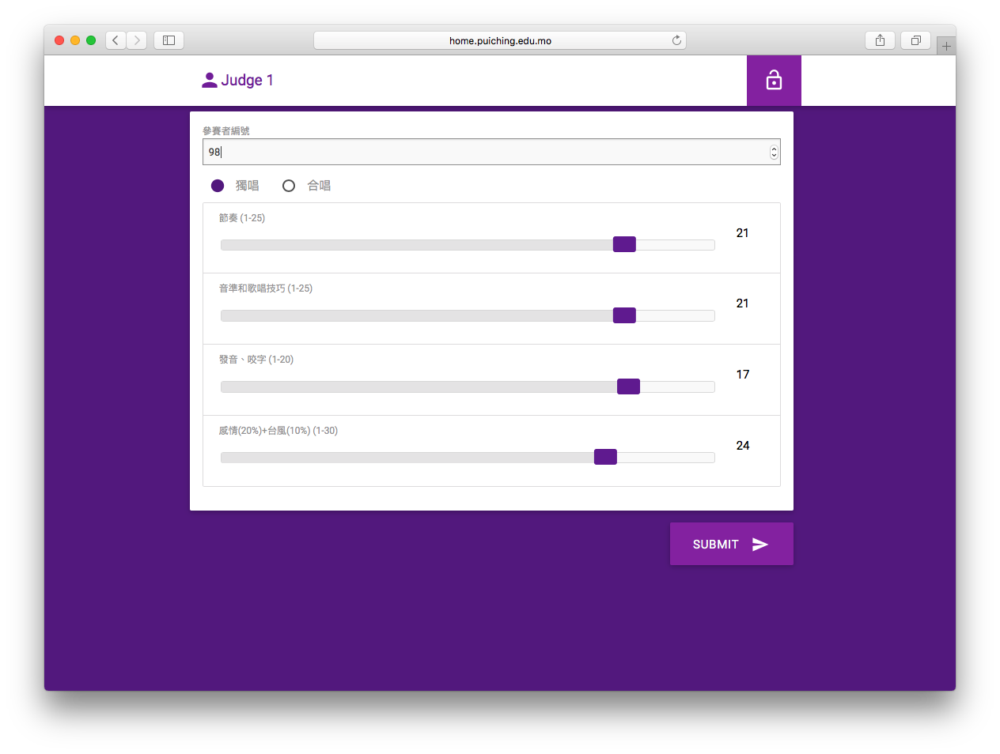

# Singing Contest Marking System
http://home.puiching.edu.mo/~pcmssa/marking

The Singing Contest Marking System is currently used by Macau Pui Ching Middle School Student Association(SA) during the annual school singing contest. It helps the judges to mark the competitors' performance in different areas. SA members could log in to the system to check the final results instantly. Also, the system is designed to be used in iPad and any other mobile devices.

## Marking Page for Judges

## Result Page for SA Members

## Password for Each Competitor to Access His/Her Marks Instantly
Other than showing the results, the system can generate a bunch of unique passwords. Each password could be used to access one specific competitor's result in [Checking My Mark (GitHub)](https://github.com/chonseng/singing-contest-checking-my-mark). The QR code in the photos redirects you to the system.
